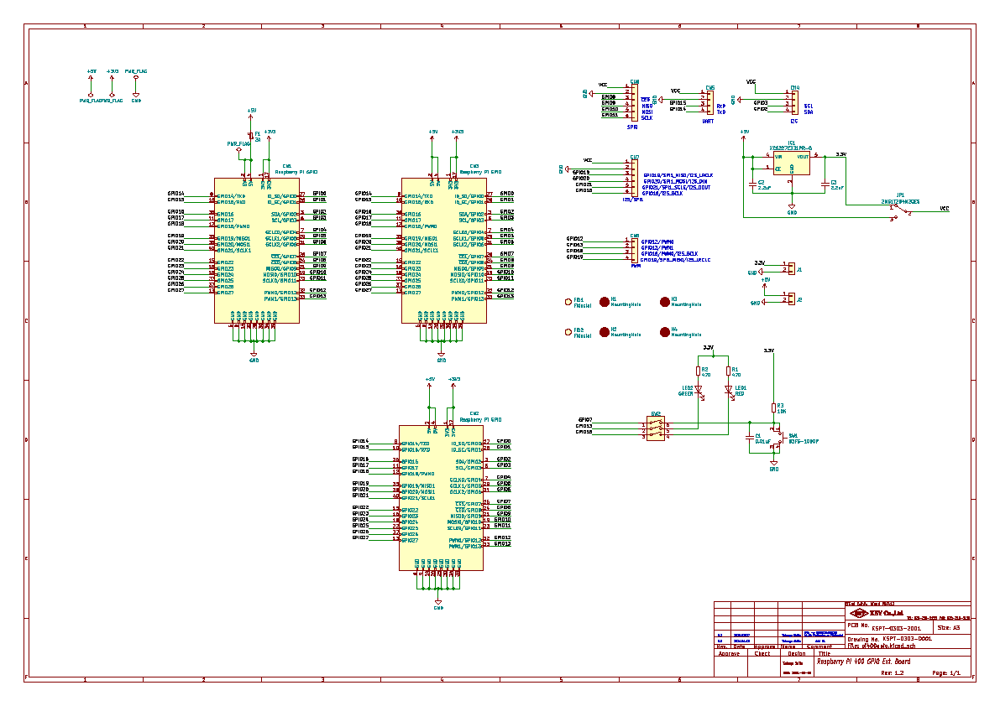

# KSY GPIO extension board for Raspberry Pi 400

RaspberryPi 400 GPIO拡張ボード   
GPIO extension board for Raspberry Pi 400

---

## 概要

  Raspberry Pi 4000向けのGPIO拡張ボードです。
  Raspberry Pi向けの各種HATを接続できます。   
  またGPIO40ピンもピンヘッダで取り出してあり、HATを利用しつつ他のGPIOも利用することができます。   
  I2C,UART,SPI等の各種センサ等を接続する為のソケットも実装されています。


 


## ハードウェア

  各種センサ等を接続する為のソケット、3.3V 700mA出力の3端子レギュレータ、LED2個、タクトスイッチ1個、LED,タクトスイッチ切り離し用ディップスイッチ、ソケットの電圧出力切り替え用のトグルスイッチを実装しています。

### LED
#### 赤色LED (LED1)
  GPIO16に接続されています。ディップスイッチで切り離しできます。   


#### 緑色LED (LED2)
  GPIO13に接続されています。ディップスイッチで切り離しできます。


### タクトスイッチ (SW1)
  GPIO7に接続されています。ディップスイッチで切り離しできます。
   
### 拡張ソケット (CN4,CN5,CN6,CN7,CN8)
  各種センサ等が接続できるようにI2C,UART,SPI,I2S,PWM信号が拡張ソケットとして実装されています。 I2C,UART,SPI,I2S向けに3.3V/5Vの電源を供給できます。
  電圧は基板上のトグルスイッチ(JP1)で切り替えます。   

注意！
  Raspberry Pi のGPIOは3.3Vです。5Vの信号を直接接続することはできません。
   
### トグルスイッチ (JP1)
  CN4,CN5,CN6,CN7の+Vo電圧を3.3Vもしくは5Vに切り替えます。


### 5V電源出力 (J2)
  Raspberry PiのGPIO 5V出力です


### 3.3V電源出力 (J1)
  3.3V 700mA出力の3端子レギュレータ出力です。

###  回路図

    

[回路図 pdf](./schematic/pi400gpio_schematic.pdf)

---

##  テストソフトウェア (```gpio_extension.py```)


Python3.7 で作成した評価用のソフトです。

赤色LEDと緑色LEDが交互点滅します。タクトスイッチを押すと赤色緑色が同時点灯します。

### 必要モジュール(Python)　　　

RPi.GPIO　　　

time    

---

## ライセンス
このライブラリはMITライセンスで配布します。 MITライセンスの詳細はLICENSE.txtを参照ください。

[MIT](./LICENSE)

## Author
  
[KSY Co., Ltd.](https://github.com/KSY-IC)
